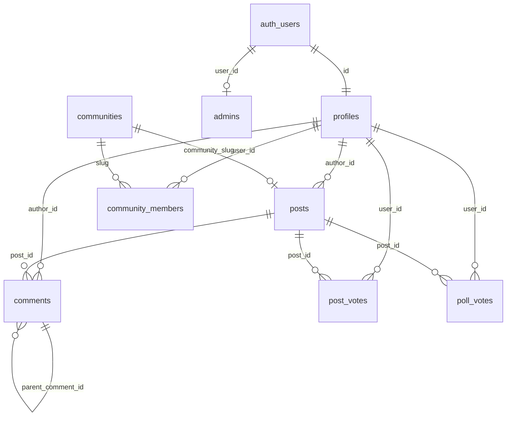

# CICS / Anonstud — Full Codebase Architecture Audit

> **Audited**: 2026-06-13 | **Commit state**: working tree | **Auditor**: Automated code inspection (every file read)

---

# Phase 1 — Project Inventory

## 1.1 Routes

| # | URL | File | Purpose | Protection | Status |
|---|-----|------|---------|------------|--------|
| 1 | `/` | [page.tsx](file:///c:/Projects/antigravity%20clone/cics1/cics1/src/app/page.tsx) | Login / signup (roll-number auth) | Public | **Working** |
| 2 | `/set-password` | [page.tsx](file:///c:/Projects/antigravity%20clone/cics1/cics1/src/app/set-password/page.tsx) | Force password change on first login | Session required (checked client-side) | **Working** |
| 3 | `/forgot-password` | [page.tsx](file:///c:/Projects/antigravity%20clone/cics1/cics1/src/app/forgot-password/page.tsx) | OTP-based password reset flow | Public | **Partially broken** — OTP email sending is a no-op stub |
| 4 | `/reset-password` | [page.tsx](file:///c:/Projects/antigravity%20clone/cics1/cics1/src/app/reset-password/page.tsx) | Handle Supabase magic-link password reset | Public (token-gated) | **Working** (requires valid token) |
| 5 | `/auth/callback` | [page.tsx](file:///c:/Projects/antigravity%20clone/cics1/cics1/src/app/auth/callback/page.tsx) | OAuth/PKCE code exchange | Public | **Working** |
| 6 | `/feed` | [page.tsx](file:///c:/Projects/antigravity%20clone/cics1/cics1/src/app/(app)/feed/page.tsx) | Main social feed | Auth required (AuthProvider) | **Working** |
| 7 | `/post/[postId]` | [page.tsx](file:///c:/Projects/antigravity%20clone/cics1/cics1/src/app/(app)/post/[postId]/page.tsx) | Post detail + comments | Auth required | **Working** |
| 8 | `/profile` | [page.tsx](file:///c:/Projects/antigravity%20clone/cics1/cics1/src/app/(app)/profile/page.tsx) | User profile + own posts | Auth required | **Working** |
| 9 | `/communities` | [page.tsx](file:///c:/Projects/antigravity%20clone/cics1/cics1/src/app/(app)/communities/page.tsx) | Community directory | Auth required | **Partially broken** — uses hardcoded `ROOMS` array, not DB communities |
| 10 | `/room/[roomName]` | [page.tsx](file:///c:/Projects/antigravity%20clone/cics1/cics1/src/app/(app)/room/[roomName]/page.tsx) | Community/room feed (Reddit-style) | Auth required | **Working** |
| 11 | `/admin/username-review` | [page.tsx](file:///c:/Projects/antigravity%20clone/cics1/cics1/src/app/(app)/admin/username-review/page.tsx) | Admin review of pseudo username change requests | Auth + Admin check | **Working** |
| 12 | `/api/reset-password` | [route.ts](file:///c:/Projects/antigravity%20clone/cics1/cics1/src/app/api/reset-password/route.ts) | Server API: admin password reset via service key | Unauthenticated (⚠️ SECURITY RISK) | **Working but insecure** |
| 13 | `/api/link-preview` | [route.ts](file:///c:/Projects/antigravity%20clone/cics1/cics1/src/app/api/link-preview/route.ts) | Server API: fetch OG metadata for link posts | No auth check | **Working** |

---

## 1.2 Layouts

| Layout | File | Controls | Auth Logic |
|--------|------|----------|------------|
| **Root** | [layout.tsx](file:///c:/Projects/antigravity%20clone/cics1/cics1/src/app/layout.tsx) | `<html>`, global CSS, font, body class | None — bare shell |
| **App group** `(app)` | [layout.tsx](file:///c:/Projects/antigravity%20clone/cics1/cics1/src/app/(app)/layout.tsx) | `AuthProvider` wrapper, desktop sidebar, mobile header + bottom nav | Client-side redirect to `/` if no session; redirect to `/set-password` if `is_first_login`; loading spinner with 10 s timeout + retry |

> [!IMPORTANT]
> There is **no server-side middleware** protecting routes. All auth gating is client-side via `useAuth()` + `useEffect` + `router.replace('/')`. This means HTML is served before the check runs, and a malicious client can read the DOM tree briefly.

---

## 1.3 All Pages (page.tsx files)

| File | Dynamic? | Notes |
|------|----------|-------|
| `src/app/page.tsx` | No | Landing / login |
| `src/app/set-password/page.tsx` | No | |
| `src/app/forgot-password/page.tsx` | No | |
| `src/app/reset-password/page.tsx` | No | |
| `src/app/auth/callback/page.tsx` | No | |
| `src/app/(app)/feed/page.tsx` | No | |
| `src/app/(app)/profile/page.tsx` | No | |
| `src/app/(app)/communities/page.tsx` | No | |
| `src/app/(app)/post/[postId]/page.tsx` | **Yes** — `[postId]` | |
| `src/app/(app)/room/[roomName]/page.tsx` | **Yes** — `[roomName]` | |
| `src/app/(app)/admin/username-review/page.tsx` | No | |

No catch-all routes exist. No `not-found.tsx` page exists.

---

## 1.4 Components Inventory

### Feed Components
| Component | File | Purpose | Used By | Status |
|-----------|------|---------|---------|--------|
| `PostCard` | [PostCard.tsx](file:///c:/Projects/antigravity%20clone/cics1/cics1/src/components/PostCard.tsx) | Render a single post in feed view | Feed, Profile, Room pages | **Active** |
| `EnhancedCreatePostForm` | [EnhancedCreatePostForm.tsx](file:///c:/Projects/antigravity%20clone/cics1/cics1/src/components/EnhancedCreatePostForm.tsx) | Full post creation (text/image/video/link/poll) | Feed, Room pages | **Active** |
| `CreatePostForm` | [CreatePostForm.tsx](file:///c:/Projects/antigravity%20clone/cics1/cics1/src/components/CreatePostForm.tsx) | Older basic post form | **Not imported anywhere** | **Dead code** |
| `PostTypeSelector` | [PostTypeSelector.tsx](file:///c:/Projects/antigravity%20clone/cics1/cics1/src/components/PostTypeSelector.tsx) | Tab selector for post types | EnhancedCreatePostForm | **Active** |
| `TextPostForm` | [TextPostForm.tsx](file:///c:/Projects/antigravity%20clone/cics1/cics1/src/components/TextPostForm.tsx) | Sub-form for text posts | EnhancedCreatePostForm | **Active** |
| `ImagePostForm` | [ImagePostForm.tsx](file:///c:/Projects/antigravity%20clone/cics1/cics1/src/components/ImagePostForm.tsx) | Sub-form for image posts | EnhancedCreatePostForm | **Active** |
| `VideoPostForm` | [VideoPostForm.tsx](file:///c:/Projects/antigravity%20clone/cics1/cics1/src/components/VideoPostForm.tsx) | Sub-form for video posts | EnhancedCreatePostForm | **Active** |
| `LinkPostForm` | [LinkPostForm.tsx](file:///c:/Projects/antigravity%20clone/cics1/cics1/src/components/LinkPostForm.tsx) | Sub-form for link posts | EnhancedCreatePostForm | **Active** |
| `PollPostForm` | [PollPostForm.tsx](file:///c:/Projects/antigravity%20clone/cics1/cics1/src/components/PollPostForm.tsx) | Sub-form for poll posts | EnhancedCreatePostForm | **Active** |
| `TagFilter` | [TagFilter.tsx](file:///c:/Projects/antigravity%20clone/cics1/cics1/src/components/TagFilter.tsx) | Tag filter chips | Room page | **Active** |
| `TagsInput` | [TagsInput.tsx](file:///c:/Projects/antigravity%20clone/cics1/cics1/src/components/TagsInput.tsx) | Tag input field | **Not imported anywhere** | **Dead code** |
| `CommunitySelector` | [CommunitySelector.tsx](file:///c:/Projects/antigravity%20clone/cics1/cics1/src/components/CommunitySelector.tsx) | Dropdown to pick community | EnhancedCreatePostForm | **Active** |

### Voting Components
| Component | File | Purpose | Used By | Status |
|-----------|------|---------|---------|--------|
| `VoteButtons` | [VoteButtons.tsx](file:///c:/Projects/antigravity%20clone/cics1/cics1/src/components/VoteButtons.tsx) | Vertical vote UI | **Not imported anywhere** | **Dead code** |
| `HorizontalVoteButtons` | [HorizontalVoteButtons.tsx](file:///c:/Projects/antigravity%20clone/cics1/cics1/src/components/HorizontalVoteButtons.tsx) | Horizontal vote UI for posts | PostCard, Post detail | **Active** |
| `CommentHorizontalVotes` | [CommentHorizontalVotes.tsx](file:///c:/Projects/antigravity%20clone/cics1/cics1/src/components/CommentHorizontalVotes.tsx) | Horizontal vote UI for comments | Post detail | **Active** |

### Auth / Verification Components
| Component | File | Purpose | Used By | Status |
|-----------|------|---------|---------|--------|
| `TrustUnlockModal` | [TrustUnlockModal.tsx](file:///c:/Projects/antigravity%20clone/cics1/cics1/src/components/TrustUnlockModal.tsx) | Explains verification + triggers email verify | Profile, Post detail, CreatePost | **Active** |
| `CollegeEmailVerificationModal` | [CollegeEmailVerificationModal.tsx](file:///c:/Projects/antigravity%20clone/cics1/cics1/src/components/CollegeEmailVerificationModal.tsx) | MGIT email OTP verification flow | TrustUnlockModal | **Active** |
| `EmailVerificationModal` | [EmailVerificationModal.tsx](file:///c:/Projects/antigravity%20clone/cics1/cics1/src/components/EmailVerificationModal.tsx) | Older email verification modal | **Not imported anywhere** | **Dead code** |

### Navigation Components
| Component | File | Purpose | Used By | Status |
|-----------|------|---------|---------|--------|
| `Sidebar` | [Sidebar.tsx](file:///c:/Projects/antigravity%20clone/cics1/cics1/src/components/Sidebar.tsx) | Desktop left sidebar with communities | App layout | **Active** |
| `BottomNav` | [BottomNav.tsx](file:///c:/Projects/antigravity%20clone/cics1/cics1/src/components/BottomNav.tsx) | Mobile bottom tab bar | App layout | **Active** |
| `RedditNavbar` | [RedditNavbar.tsx](file:///c:/Projects/antigravity%20clone/cics1/cics1/src/components/RedditNavbar.tsx) | Top navbar (Reddit-style) | Room page only | **Active** |
| `RedditSidebar` | [RedditSidebar.tsx](file:///c:/Projects/antigravity%20clone/cics1/cics1/src/components/RedditSidebar.tsx) | Left sidebar (Reddit-style) | Room page only | **Active** |
| `RedditRightPanel` | [RedditRightPanel.tsx](file:///c:/Projects/antigravity%20clone/cics1/cics1/src/components/RedditRightPanel.tsx) | Right sidebar | Room page only | **Active** |
| `RedditMobileNav` | [RedditMobileNav.tsx](file:///c:/Projects/antigravity%20clone/cics1/cics1/src/components/RedditMobileNav.tsx) | Mobile nav (Reddit-style) | **Not imported anywhere** | **Dead code** |

### Rich Text / Editor Components
| Component | File | Purpose | Used By | Status |
|-----------|------|---------|---------|--------|
| `RichTextEditor` | [RichTextEditor.tsx](file:///c:/Projects/antigravity%20clone/cics1/cics1/src/components/RichTextEditor.tsx) | Quill editor wrapper | **Not imported anywhere** | **Dead code** |
| `RichTextEditorModern` | [RichTextEditorModern.tsx](file:///c:/Projects/antigravity%20clone/cics1/cics1/src/components/RichTextEditorModern.tsx) | Modern Quill editor wrapper | **Not imported anywhere** | **Dead code** |

### Error/UI Components
| Component | File | Purpose | Used By | Status |
|-----------|------|---------|---------|--------|
| `ErrorBoundary` | [ErrorBoundary.tsx](file:///c:/Projects/antigravity%20clone/cics1/cics1/src/components/ErrorBoundary.tsx) | Class-based error boundary | Profile, Room, Admin pages | **Active** |
| `ErrorBoundaryFunctional` | [ErrorBoundaryFunctional.tsx](file:///c:/Projects/antigravity%20clone/cics1/cics1/src/components/ErrorBoundaryFunctional.tsx) | Functional error boundary | Feed page | **Active** |
| `ErrorBoundaryModern` | [ErrorBoundaryModern.tsx](file:///c:/Projects/antigravity%20clone/cics1/cics1/src/components/ErrorBoundaryModern.tsx) | Third error boundary variant | **Not imported anywhere** | **Dead code** |
| `EmptyState` | [EmptyState.tsx](file:///c:/Projects/antigravity%20clone/cics1/cics1/src/components/ui/EmptyState.tsx) | Empty state display | Feed, Profile, Room pages | **Active** |
| `ErrorMessage` | [ErrorMessage.tsx](file:///c:/Projects/antigravity%20clone/cics1/cics1/src/components/ui/ErrorMessage.tsx) | Error display card | Feed, Profile, Room pages | **Active** |
| `LoadingSpinner` | [LoadingSpinner.tsx](file:///c:/Projects/antigravity%20clone/cics1/cics1/src/components/ui/LoadingSpinner.tsx) | Spinner | Various | **Active** |
| `PostLoadingSkeleton` | [PostLoadingSkeleton.tsx](file:///c:/Projects/antigravity%20clone/cics1/cics1/src/components/ui/PostLoadingSkeleton.tsx) | Skeleton loader | Feed, Profile, Room pages | **Active** |
| `SkeletonFeed` | [SkeletonFeed.tsx](file:///c:/Projects/antigravity%20clone/cics1/cics1/src/components/ui/SkeletonFeed.tsx) | Full-feed skeleton | Feed page | **Active** |

---

# Phase 2 — Feature Discovery

| # | Feature | State | Notes |
|---|---------|-------|-------|
| 1 | **Authentication (roll-number login)** | ✅ Working | First-time users auto-signup with default password `cics@123`, forced password change on first login |
| 2 | **Posting (text)** | ✅ Working | Text posts via EnhancedCreatePostForm |
| 3 | **Posting (image)** | ✅ Working | Uploads to `post-images` Supabase bucket |
| 4 | **Posting (video)** | ⚠️ Partial | Form exists; uploads to `post-videos` bucket. **No video player on display** — PostCard only renders `image_url`, not `video_url` |
| 5 | **Posting (link)** | ⚠️ Partial | Form exists with link-preview API. **No link preview rendering** on PostCard |
| 6 | **Posting (poll)** | ⚠️ Partial | Form exists. **No poll voting UI** on PostCard. `poll_votes` table schema exists but frontend never queries or renders it |
| 7 | **Voting (posts)** | ✅ Working | Upvote/downvote with trigger-based count sync |
| 8 | **Voting (comments)** | ❌ Broken | `CommentHorizontalVotes` passes `initialUpvotes={0}` and `initialDownvotes={0}` hardcoded. **No `comment_votes` table exists** in schema |
| 9 | **Comments** | ✅ Working | Threaded comments with nested replies, optimistic updates, real-time subscription |
| 10 | **Communities** | ✅ Working | 5 core communities (campus, confessions, placements, clubs, alumni), join/leave, membership |
| 11 | **Community directory** | ⚠️ Partial | Communities page uses hardcoded `ROOMS` array instead of DB data |
| 12 | **Identity system (4 modes)** | ✅ Working | Pseudo, Full, Partial, Anonymous — well-implemented with `identityDisplay.ts` |
| 13 | **Pseudo username** | ✅ Working | Auto-generated on signup, change request with admin review, 30-day cooldown |
| 14 | **Student verification (MGIT email)** | ⚠️ Partial | OTP generation works, storage works, **email sending is a no-op stub** (`sendOTPEmail` logs to console only) |
| 15 | **Password reset** | ⚠️ Partial | Flow exists but depends on email sending which is not implemented |
| 16 | **Admin: username review** | ✅ Working | Admin can approve/reject pseudo username changes |
| 17 | **Real-time updates** | ✅ Working | Supabase Realtime channels for new posts and comments |
| 18 | **Post tags** | ⚠️ Partial | Tags column in DB, TagFilter on room page. **No tag input on post creation form** (TagsInput exists but is dead code) |
| 19 | **Drafts** | ❌ Not connected | `is_draft` column exists, "Save Draft" button exists, but posts are always inserted with `is_draft` not set (defaults to `false`). No drafts listing page |
| 20 | **Notifications** | ❌ Missing | No notification system exists |
| 21 | **Moderation / Reports** | ❌ Missing | No report system, no moderation tools beyond username review |
| 22 | **User search** | ❌ Missing | |
| 23 | **Post editing** | ❌ Missing | RLS allows update but no UI exists |
| 24 | **Post deletion** | ❌ Missing | RLS allows delete but no UI exists |
| 25 | **Dynamic year calculation** | ✅ Working | Year auto-recalculates on login based on academic calendar |
| 26 | **Community prefetching** | ✅ Working | Room page prefetches adjacent community posts |

---

# Phase 3 — Database Audit

## 3.1 Tables

| Table | Purpose | Key Columns |
|-------|---------|-------------|
| `profiles` | User profiles | `id` (FK→auth.users), `username`, `roll_number`, `year`, `branch`, `section`, `is_first_login`, `is_verified`, `is_anonymous`, `is_email_verified`, `pseudo_username`, `pending_pseudo_username`, `pseudo_username_status`, `show_roll_number_publicly`, `real_display_name` |
| `posts` | User posts | `id`, `author_id` (FK→profiles), `room`, `content`, `image_url`, `video_url`, `link_url`, `is_anon_post`, `display_mode`, `post_type`, `headline`, `description`, `tags`, `community_slug`, `is_draft`, `upvotes`, `downvotes`, `poll_options`, `poll_expires_at` |
| `comments` | Post comments (threaded) | `id`, `post_id` (FK→posts), `author_id` (FK→profiles), `parent_comment_id` (FK→self), `content`, `is_anon_comment`, `display_mode` |
| `communities` | Community definitions | `id`, `name`, `slug` (unique), `description`, `icon`, `type`, `member_count` |
| `community_members` | Membership join table | `user_id` (FK→profiles), `community_slug` (FK→communities.slug), PK composite |
| `post_votes` | Post up/down votes | `id`, `user_id` (FK→profiles), `post_id` (FK→posts), `vote_type`, UNIQUE(user_id, post_id) |
| `poll_votes` | Poll option votes | `id`, `user_id` (FK→profiles), `post_id` (FK→posts), `option_index`, UNIQUE(user_id, post_id) |
| `admins` | Admin user lookup | `user_id` (FK→auth.users), PK |
| `otp_codes` | OTP verification codes | `email`, `code`, `type`, `expires_at` (referenced in code but **CREATE TABLE not found** in checked SQL files) |

> [!WARNING]
> The `otp_codes` table is used by `src/lib/otp.ts` but no SQL migration for its creation was found in the repo. If the table doesn't exist in Supabase, the entire forgot-password and email-verification flow will error.

## 3.2 Views

| View | Purpose |
|------|---------|
| `pending_verifications` | Lists profiles with uploaded ID cards that haven't been verified |
| `poll_results` | Aggregates poll vote counts per option |

## 3.3 Foreign Keys



## 3.4 Indexes

**Existing indexes:**
- `posts_room_idx` — `posts(room)`
- `posts_created_at_idx` — `posts(created_at DESC)`
- `posts_author_id_idx` — `posts(author_id)`
- `comments_post_id_idx` — `comments(post_id)`
- `comments_parent_comment_id_idx` — `comments(parent_comment_id)`
- `posts_post_type_idx` — `posts(post_type)`
- `posts_community_slug_idx` — `posts(community_slug)`
- `posts_tags_idx` — `posts USING GIN(tags)`
- `posts_is_draft_idx` — `posts(is_draft)`
- `posts_poll_expires_at_idx` — `posts(poll_expires_at)`
- `profiles_pseudo_username_unique_idx` — partial unique index on `pseudo_username`
- `profiles_pending_pseudo_username_idx` — partial index

**Missing indexes:**
- `post_votes(user_id, post_id)` — the UNIQUE constraint acts as an index but a dedicated composite index on `(user_id)` for the vote-fetch query would help
- `comments(created_at)` — comments are ordered by `created_at` but no index
- `community_members(community_slug)` — for member count queries

## 3.5 RLS Policies

| Table | SELECT | INSERT | UPDATE | DELETE |
|-------|--------|--------|--------|--------|
| **profiles** | ✅ Public (everyone) | ✅ Own profile only (`auth.uid() = id`) | ✅ Own profile only | ❌ No delete policy |
| **posts** | ✅ Authenticated + `is_draft = FALSE` | ✅ Authenticated + own (`author_id = auth.uid()`) | ✅ Own posts | ✅ Own posts |
| **comments** | ✅ Authenticated | ✅ Authenticated | ✅ Own comments | ✅ Own comments |
| **communities** | ✅ Authenticated | ❌ No insert policy | ❌ No update policy | ❌ No delete policy |
| **community_members** | ✅ Authenticated | ✅ Own membership (`auth.uid() = user_id`) | ❌ No update policy | ✅ Own membership |
| **post_votes** | ✅ Authenticated | ✅ Own votes | ✅ Own votes | ✅ Own votes |
| **poll_votes** | ✅ Authenticated | ✅ Own votes | ✅ Own votes | ✅ Own votes |

> [!CAUTION]
> **Profiles are readable by everyone** — including `roll_number`, `email`, `college_email`. While the frontend deliberately hides roll numbers, **any authenticated user can query the `profiles` table directly via the Supabase client** and extract every user's roll number, email, year, branch, and section.

---

# Phase 4 — Authentication Audit

## Auth Flow

```
1. User enters roll number + password on / page
2. Client normalizes roll → UPPERCASE
3. If password == "cics@123" (default):
   a. Parse roll number → extract year/branch/section
   b. Look up existing profile by roll_number
   c. If not found → supabase.auth.signUp() with {ROLL}@cics.local email
   d. Create/upsert profile with is_first_login=true
   e. Redirect → /set-password
4. If password != default:
   a. Build email candidates (roll@cics.local, username@cics.local, raw email)
   b. Try signInWithPassword() against each candidate
   c. If success → check is_first_login
   d. Redirect → /feed or /set-password
5. On /set-password:
   a. User sets new password
   b. Profile updated: is_first_login=false
   c. Redirect → /feed
```

## Session Restoration
- `AuthContext` calls `supabase.auth.getSession()` on mount with 15s timeout + 3 retries
- Handles `NavigatorLockAcquireTimeoutError` (Supabase auth lock race condition)
- Handles stale refresh tokens by signing out
- `onAuthStateChange` listener updates state on token refresh

## Protected Routes
- **Mechanism**: Client-side `useEffect` in `(app)/layout.tsx` checks `user` / `session` / `profile` from AuthContext
- If no user → `router.replace('/')`
- If `profile.is_first_login` → `router.replace('/set-password')`
- **No server middleware** — all checks happen after hydration

## Logout
- `signOut()` in AuthContext → `supabase.auth.signOut()` + clears local state
- Sidebar and Profile page both offer sign-out

## Auth Issues Identified

> [!WARNING]
> 1. **No server-side middleware**: Protected pages render before client-side redirect fires. The HTML/JS bundle is served to unauthenticated users.
> 2. **Default password hardcoded in client**: `const DEFAULT_PASSWORD = 'cics@123'` is visible in the source bundle. Anyone can see this.
> 3. **`/api/reset-password` is completely unauthenticated**: Any client can POST `{userId, newPassword, rollNumber}` and reset any user's password. The only "validation" is checking that fields are non-empty.
> 4. **Email-based auth (cics.local)**: The synthetic `@cics.local` email domain means Supabase cannot send real emails for account recovery. This is by design but means the forgot-password flow requires the custom OTP system, which has no email backend.
> 5. **`ProfileContext.tsx`** exists separately from `AuthContext.tsx` but is **never used** — it's dead code with a divergent PROFILE_SELECT that doesn't include identity v4 columns.

---

# Phase 5 — Identity System Audit

The identity system has **4 modes**, defined in [identityDisplay.ts](file:///c:/Projects/antigravity%20clone/cics1/cics1/src/lib/identityDisplay.ts):

| Mode | Display Name | Access | Implemented? |
|------|-------------|--------|--------------|
| **Pseudo** (default) | Auto-generated PascalCase name (e.g. "CosmicFox") | Everyone | ✅ Fully implemented |
| **Full** | `real_display_name` → `full_name` → `username` → `pseudo_username` fallback | Everyone | ✅ Implemented (but `real_display_name`/`full_name` are never set by any UI, so falls back to `username` = roll number) |
| **Partial** | Branch + Year (e.g. "CSE · 3rd Year") | Verified only | ✅ Implemented |
| **Anonymous** | "Anonymous" with 👻 avatar | Verified only | ✅ Implemented |

**Important findings:**
- **Roll numbers are explicitly never shown** in display logic (`identityDisplay.ts` line 139: "NEVER show roll_number")
- **But**: the `full` mode falls back to `username`, which **is the roll number** for most users (set during signup). So "full identity" mode effectively shows the roll number for users who haven't set a `real_display_name`.
- `real_display_name` has **no UI** for users to set it. It's always `null`.
- The pseudo username system is well-designed with profanity filters, roll-number detection, admin approval flow, and 30-day cooldown.

---

# Phase 6 — Feed Architecture Audit

## Feed Loading
- Implemented in [useFeedPosts.ts](file:///c:/Projects/antigravity%20clone/cics1/cics1/src/hooks/useFeedPosts.ts) — a custom hook with:
  - **In-memory feed cache** keyed by community
  - **Cache TTL**: 45 seconds
  - **Request timeout**: 10 seconds
  - **Abort controller** for canceling stale requests
  - **Request deduplication** via `latestRequestId` ref

## Pagination
- Cursor-based using `.range()` — PAGE_SIZE = 15
- "Load More" button (not infinite scroll)

## Query Structure
```sql
SELECT id, author_id, room, content, image_url, is_anon_post, display_mode,
       year_tag, branch_tag, section_tag, created_at, upvotes, downvotes,
       profiles (id, username, roll_number, is_verified, ...),
       comment_count:comments(count)
FROM posts
WHERE room IN (filters)
ORDER BY created_at DESC, id DESC
RANGE(page*15, page*15+14)
```
Then a **separate query** for user votes: `SELECT post_id, vote_type FROM post_votes WHERE user_id = ? AND post_id IN (?)`

## Performance Issues

> [!WARNING]
> 1. **N+1 risk on room page**: The room page's `fetchPosts()` does NOT include `comment_count` in the select — it hardcodes `comment_count: 0`. Comments aren't counted for room posts.
> 2. **Duplicate Supabase client creation**: `createClient()` is called via `useMemo(() => createClient(), [])` in every component that needs it, but the underlying function returns a singleton. The `useMemo` is pointless overhead.
> 3. **No sorting options**: Feed is always sorted by `created_at DESC`. No hot/top/controversial sorting.
> 4. **Real-time subscription on feed**: The feed subscribes to ALL `INSERT` events on the `posts` table and does a full refresh. This means every new post by any user triggers a complete re-fetch.

---

# Phase 7 — Community System Audit

## What's Implemented
- 5 core communities: `campus`, `confessions`, `placements`, `clubs`, `alumni`
- Auto-join on signup (campus + confessions for anon, campus + placements + clubs for students)
- Join/leave toggle on room page
- Cannot leave `campus`
- Membership check before allowing posts in room page
- Community prefetching for adjacent rooms
- Trigger-based `member_count` sync

## What's Missing
- **No community creation UI** — communities can only be created via SQL
- **No community settings/moderation** per community
- **No community-specific rules** (e.g. "confessions" should force anonymous, but this is only enforced via default mode suggestion, not hard enforcement)
- **Community directory page** uses hardcoded `ROOMS` array instead of querying DB
- **Private communities** — `type` column exists but only `open` and `auto` are used
- **No community search**

---

# Phase 8 — Admin & Moderation Audit

| Feature | Status |
|---------|--------|
| Admin table + lookup | ✅ Exists — `admins` table |
| Admin route protection | ✅ Client-side check against `admins` table |
| Username review | ✅ Approve/reject pending pseudo username changes |
| Report posts | ❌ Missing |
| Report comments | ❌ Missing |
| Ban/mute users | ❌ Missing |
| Moderator roles per community | ❌ Missing |
| Content moderation queue | ❌ Missing |
| User management | ❌ Missing |
| Audit logs | ❌ Missing |
| ID card verification workflow | ⚠️ Partial — `pending_verifications` view exists, but **no admin UI** to review ID cards |

---

# Phase 9 — Security Review

### 🔴 Critical

1. **`/api/reset-password` has no authentication**
   - Any client can POST `{userId, newPassword, rollNumber}` and reset any user's password using the service role key.
   - **Impact**: Complete account takeover of any user.
   - **File**: [route.ts](file:///c:/Projects/antigravity%20clone/cics1/cics1/src/app/api/reset-password/route.ts)

2. **Profiles table is fully readable**
   - RLS policy: `FOR SELECT USING (true)` — all profile data including `roll_number`, `email`, `college_email` is queryable by any authenticated user.
   - **Impact**: Mass extraction of student PII.

### 🟠 High

3. **No server-side route protection**
   - Protected pages are rendered client-side. An attacker can read page source before redirect.

4. **Default password in client bundle**
   - `DEFAULT_PASSWORD = 'cics@123'` in `page.tsx` — anyone can see this and attempt first-time login for any roll number.

5. **`full` identity mode leaks roll numbers**
   - Since `username` defaults to the roll number and `real_display_name` is always null, posting in "full" mode reveals the roll number.

6. **Service role key exposure risk**
   - `SUPABASE_SERVICE_ROLE_KEY` is used server-side in the reset-password API route. If `.env.local` is ever committed or exposed, it grants full admin access.

### 🟡 Medium

7. **OTP email sending is a stub** — verification flows silently succeed without actually sending emails (except in dev where OTP is logged)
8. **No rate limiting** on any API route or auth endpoint
9. **Link preview SSRF risk** — `/api/link-preview` fetches arbitrary URLs server-side with no allowlist
10. **`post-images` bucket is public** — anyone can list and access all uploaded images

### 🟢 Low

11. **No CSRF protection** beyond what Supabase auth provides
12. **No Content Security Policy** headers configured
13. **3 different ErrorBoundary implementations** — inconsistent error handling

---

# Phase 10 — Technical Debt Analysis

## Dead Code

| File | Type | Suggested Action |
|------|------|-----------------|
| `src/components/CreatePostForm.tsx` | Unused component | Delete — superseded by EnhancedCreatePostForm |
| `src/components/VoteButtons.tsx` | Unused component | Delete — superseded by HorizontalVoteButtons |
| `src/components/EmailVerificationModal.tsx` | Unused component | Delete — superseded by CollegeEmailVerificationModal |
| `src/components/RichTextEditor.tsx` | Unused component | Delete — never imported |
| `src/components/RichTextEditorModern.tsx` | Unused component | Delete — never imported |
| `src/components/RedditMobileNav.tsx` | Unused component | Delete — never imported |
| `src/components/ErrorBoundaryModern.tsx` | Unused component | Delete — never imported |
| `src/components/TagsInput.tsx` | Unused component | Delete or integrate into post creation |
| `src/contexts/ProfileContext.tsx` | Unused context | Delete — AuthContext handles profile |
| `src/lib/utils.ts → generateAnonUsername()` | Unused function | Delete — usernameGenerator.ts handles this |

## Duplicate Logic
- **Profile fetching**: AuthContext and ProfileContext both fetch profiles with different `SELECT` columns
- **3 ErrorBoundary variants**: ErrorBoundary, ErrorBoundaryFunctional, ErrorBoundaryModern
- **Supabase client creation**: `useMemo(() => createClient(), [])` pattern repeated in 10+ files unnecessarily
- **ROOMS constant** in `types/index.ts` is stale — doesn't match the actual DB communities (missing placements, clubs, alumni; includes year/branch/section which aren't rooms)

## Scattered SQL Files
9 SQL files in root directory with overlapping/conflicting schemas:
- `supabase-schema.sql`, `enhanced-post-schema.sql`, `enhanced-post-schema-safe.sql`, `update-post-schema.sql`, `otp-schema.sql`, `college-email-verification.sql`, `create-basic-communities.sql`, `reddit-hybrid-communities.sql`, `soft-verification-model.sql`, `alumni-community.sql`, `performance-indexes.sql`

These are not managed migrations — they're ad-hoc SQL files that may or may not have been run.

---

# Phase 11 — Dependency Audit

| Package | Version | Purpose | Used? |
|---------|---------|---------|-------|
| `@supabase/ssr` | ^0.10.2 | Supabase SSR client (browser) | ✅ Used (supabase.ts) |
| `@supabase/supabase-js` | ^2.105.1 | Supabase JS client | ✅ Used (supabase-admin.ts, API routes) |
| `next` | ^16.2.4 | Framework | ✅ Used |
| `react` | ^18 | UI library | ✅ Used |
| `react-dom` | ^18 | React DOM | ✅ Used |
| `quill` | ^2.0.3 | Rich text editor core | ❌ **Unused** — RichTextEditor components are dead code |
| `react-quill` | ^2.0.0 | React Quill wrapper | ❌ **Unused** — never imported in active code |
| `@eslint/eslintrc` | ^3.3.5 | ESLint config | ✅ Dev tool |
| `@playwright/test` | ^1.59.1 | E2E testing | ✅ Used (3 test files) |
| `@types/*` | Various | TypeScript types | ✅ Dev tool |
| `eslint` | ^9.39.4 | Linter | ✅ Dev tool |
| `eslint-config-next` | ^16.2.6 | Next.js ESLint config | ✅ Dev tool |
| `postcss` | ^8 | CSS processing | ✅ Used |
| `tailwindcss` | ^3.4.1 | CSS framework | ✅ Used extensively |
| `typescript` | ^5 | Type system | ✅ Used |

**Unused packages to remove**: `quill`, `react-quill`

---

# Phase 12 — Build & Runtime Audit

> [!NOTE]
> Build was not run as part of this audit to avoid modifying the workspace. The following are identified risks from code inspection.

### Known Build Risks
1. **`react-quill`** is React 17 compatible; running with React 18 may produce deprecation warnings
2. **`output: 'standalone'`** in next.config.mjs — deployments require the standalone output directory structure
3. **No `middleware.ts`** exists — auth protection relies entirely on client-side code
4. **`useSearchParams()`** used in `reset-password/page.tsx` and `feed/page.tsx` without `<Suspense>` boundaries — Next.js 16 requires Suspense for `useSearchParams` in client components

### Hydration Risks
1. `forgot-password/page.tsx` uses `isClient` state pattern to avoid hydration mismatch — indicates prior hydration issues
2. `reset-password/page.tsx` directly calls `useSearchParams()` which can cause hydration mismatch without Suspense
3. All pages are `'use client'` — the entire app is client-rendered with zero SSR benefit

---

# Phase 13 — Architecture Diagram

```mermaid
graph TD
    User[👤 User Browser]
    
    subgraph "Next.js App (Client-Side)"
        Login[/ Login Page]
        SetPW[/set-password]
        ForgotPW[/forgot-password]
        
        subgraph "Protected (app) Group"
            Feed[/feed]
            Post[/post/:id]
            Profile[/profile]
            Room[/room/:name]
            Communities[/communities]
            Admin[/admin/username-review]
        end
        
        AuthCtx[AuthContext Provider]
        FeedHook[useFeedPosts Hook]
    end
    
    subgraph "Next.js API Routes"
        ResetAPI[POST /api/reset-password]
        LinkAPI[GET /api/link-preview]
    end
    
    subgraph "Supabase"
        Auth[Auth Service]
        DB[(PostgreSQL)]
        Storage[Storage Buckets]
        Realtime[Realtime Channels]
    end
    
    User --> Login
    Login --> Auth
    Auth --> DB
    
    AuthCtx --> Auth
    AuthCtx --> DB
    
    Feed --> FeedHook
    FeedHook --> DB
    FeedHook --> Realtime
    
    Post --> DB
    Post --> Realtime
    Profile --> DB
    Room --> DB
    Room --> Realtime
    Admin --> DB
    
    ResetAPI --> Auth
    LinkAPI --> External[External URLs]
    
    DB --> Storage
```

### Data Flow
1. **Login**: Browser → Supabase Auth (signIn/signUp) → Profile upsert → Community membership sync
2. **Feed Load**: AuthContext ready → `useFeedPosts` hook → Supabase query (posts + profiles join + comment count) → Separate vote query → Merge + cache → Render
3. **Post Creation**: Form → Supabase Storage (images/videos) → Supabase Insert → Real-time broadcast → Other clients refresh
4. **Comment**: Optimistic insert → Supabase insert → Real-time subscription updates all clients

---

# Phase 14 — Product Status Report

## ✅ Working Features
- Roll-number based authentication with auto-signup
- Mandatory password change on first login
- Text and image posting with community selection
- 4-mode identity system (pseudo, full, partial, anonymous)
- Post voting (upvote/downvote) with DB trigger sync
- Threaded comments with nested replies
- Community system with 5 core communities
- Join/leave communities
- Real-time post and comment updates
- Auto-generated pseudo usernames with profanity filter
- Admin username review/approval system
- Dynamic year calculation from roll number
- Mobile-responsive layout with sidebar + bottom nav
- Post cache with TTL for fast community switching
- Community prefetching

## ⚠️ Partially Implemented Features
- **Video posts**: Form exists, upload works, but no video player on display
- **Link posts**: Form + preview API exist, but no link card rendering in feed
- **Poll posts**: Form + DB schema exist, but no voting UI or results display
- **Student email verification**: Complete flow exists but email sending is a no-op stub
- **Password reset**: UI flow complete but depends on non-functional email sending
- **Post tags**: DB column + filter UI exist, but no tag input on post creation
- **Community directory**: Page exists but uses hardcoded data instead of DB
- **ID card verification**: Upload works, admin view exists, but no admin UI

## ❌ Broken Features
- **Comment voting**: UI renders but always shows 0 — no database table or logic
- **Drafts**: "Save Draft" button exists but posts are never saved as drafts
- **`full` identity mode**: Effectively shows roll number as display name

## 🚫 Missing Features
- Notifications
- Post editing and deletion UI
- Report/flag system
- Content moderation tools
- User search
- Community creation UI
- Community-specific rules enforcement
- User profile viewing (others' profiles)
- Server-side auth middleware
- Rate limiting
- Password strength requirements beyond 6 chars

## 🔒 Security Risks (Ranked)

| Priority | Issue |
|----------|-------|
| **CRITICAL** | `/api/reset-password` allows unauthenticated password reset of any user |
| **CRITICAL** | Profiles RLS exposes all student PII (roll numbers, emails) to any authenticated user |
| **HIGH** | No server middleware — protected pages served before auth check |
| **HIGH** | Default password visible in client bundle |
| **HIGH** | Full identity mode leaks roll numbers via username fallback |
| **MEDIUM** | Link preview API allows SSRF |
| **MEDIUM** | No rate limiting anywhere |
| **LOW** | No CSP headers |

## 📋 Recommended Next Priorities

### Critical (Do Immediately)
1. **Add authentication to `/api/reset-password`** — validate the request comes from a verified OTP session
2. **Restrict profiles RLS** — hide `roll_number`, `email`, `college_email` from other users. Create a separate `profiles_public` view with only safe columns
3. **Add Next.js middleware** for server-side route protection

### High Priority
4. Implement email sending service (Resend/SendGrid) for OTP delivery
5. Fix "full" identity mode — don't fall back to `username` (which is the roll number)
6. Remove dead code (8+ unused components, unused packages)
7. Add rate limiting to API routes

### Medium Priority
8. Implement comment voting with a `comment_votes` table
9. Connect video/link/poll rendering in PostCard
10. Build a proper community directory page from DB data
11. Add post edit/delete UI
12. Consolidate SQL files into proper numbered migrations

### Low Priority
13. Add user profile viewing (for others)
14. Implement notification system
15. Add post sorting options (hot, top, new)
16. Implement report/flag system
17. Remove `quill` and `react-quill` from dependencies
